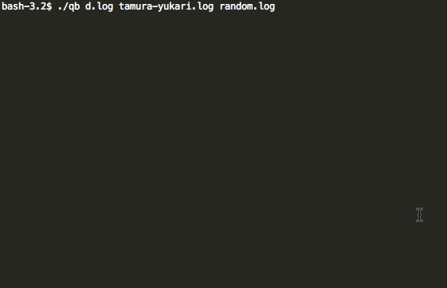

QB
==============================

QB (`q-bi` that nine-tailed fox in Japanese) is multi-file tailer (like `tail -f a.log b.log ...`).

Demo
------------------------------



1. Preparation

    ```sh
    $ yukari() { echo '世界一かわいいよ!!' }
    $ while :; do       yukari >> tamura-yukari.log ; sleep 0.3 ; done
    $ while :; do echo $RANDOM >> random.log        ; sleep 0.5 ; done
    $ while :; do         date >>      d.log        ; sleep 1   ; done
    ```

1. Run

    ```
    $ qb d.log tamura-yukari.log random.log
    ```

License
------------------------------

MIT License
